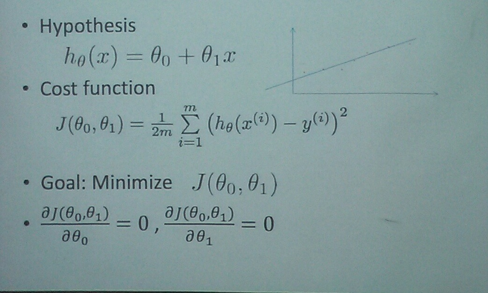
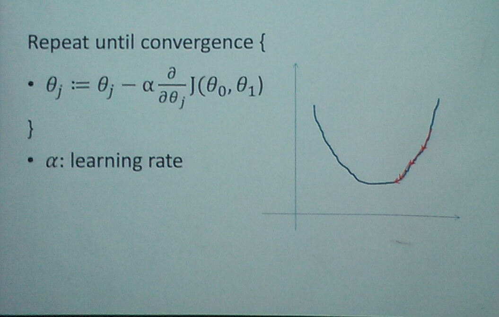
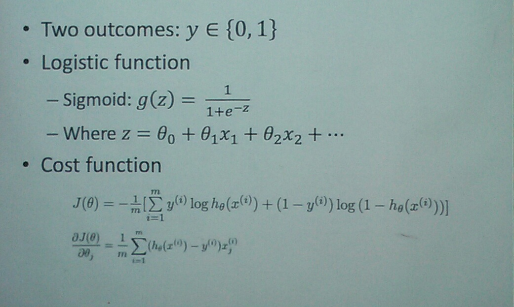
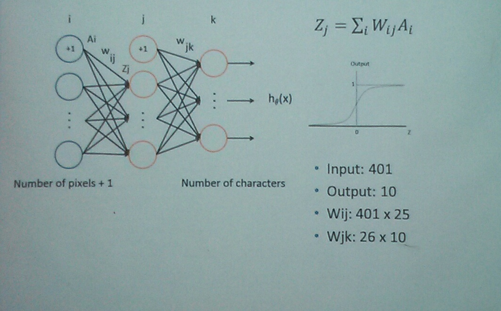
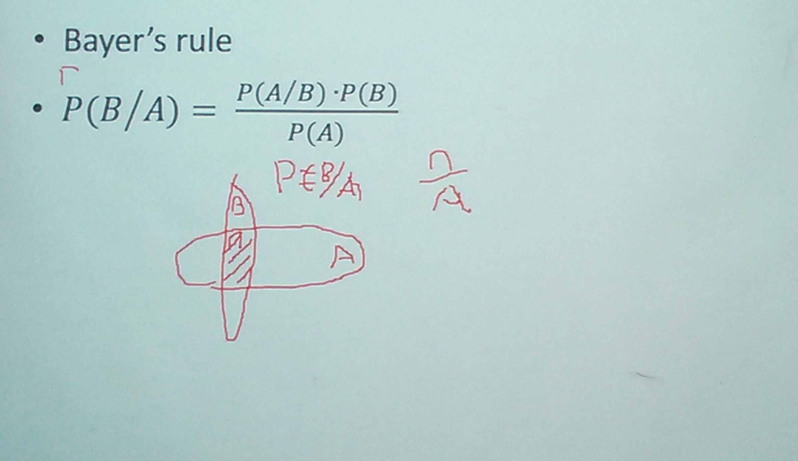

# Machine Learning Made Simple

## Agenda

* Divided into two grounds, supervised and unsupervised learning
  * Supervised learning
    * Inspiration from line fitting
    * A numerical optimization method - gradient descent
    * Binary (logical) classification
    * Multiple classification
    * Neural network and support vector machine
  * Unsupervised learning

## Supervised Learning

### Inspiration - Line Fitting

### Numerical Method - Gradient Descent

### Binary (logistic) Classification

### Multi-Classification

* One vs. All:
  * Either is or is not
  * Repeat this for each class

### A Few Other Terminologies

* Over-fitting
* Training set/cross-validation/test set
* Regularization
  * Cost function, tries to penalize large parameters
* Bias/variance
  * High bias: data conversion, but large error
  * High variance: data does not converge

### Neural Network

### Support Vector Machine

* Often appears in the same context of neural network.
* Easier to train than neural network.

## Unsupervised Learning

* Dimensional reduction - principle component analysis
* Clustering:
  * K-mean when it is possible to calculate Euclidean distance
  * Minimum-cut for graphs

### Statistical Reasoning

## Resources

* Machine learning course on Coursera (http://coursera.org)
* Caltech Learn from Data course (http://work.caltech.edu/telecourse.html)
* UCI machine learning data sets (http://archive.ics.uci.edu/ml/datasets.html)
* Kaggle competitions (http://www.kaggle.com/)
