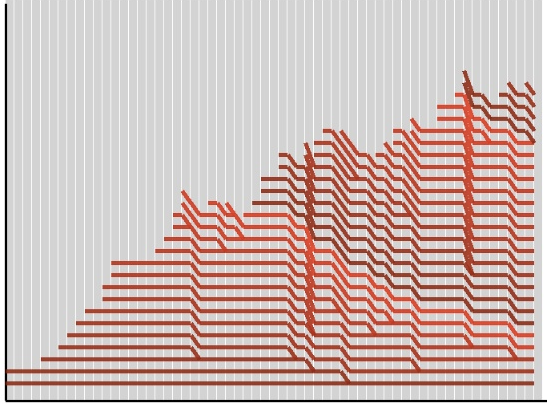

# The Code Report

## Production

* Biggest warning sign is when a company hasn't ever released to production
  (unless they're new).
* 3 months... better, but still not optimal. (company probably uses waterfall)
* 2 weeks ago... even better, probably scrum on 2 week iterations
* 1 day ago... kanban or continuous delivery.

### Automated Builds

* Important!
* Low terror level.
* Allows frequent deployment.

## Bugs

* Bugs easily pile up.

## Check-Ins

* Check in often, don't do big check ins. It's important to check-in during the
  workday and not work overtime to reinforce bad habits.

## Meetings

* Meetings are a context switch for programmers.
* Think of meetings as a tax on your development team. Sometimes they're worth
  paying, but often times not.

## Code Coverage

* Unit tests are **good**.
* They should be integrated as part of the development process through TDD.
  * TDD produces code with near 100% code coverage.

## Churn

* **Churn** - Amount of change that's happening, size of checkins, etc
* High churn generally shows low quality of code.
  * Broken code is fixed, broken again, fixed, etc.

## Duplication

* Duplication is **bad**.
* Duplicated indicates bad design.
* As duplication increases, mantainability decreases

## Morale

* Morale going down leads to more morale going down and so on.
* Low moral produces more technical debt and more and more technical debt.
