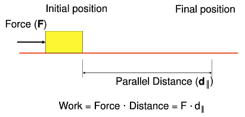

# Mechanisms & Simple Machines: Level, Wheel, and Axle, & Pulley

## Simple Machines

* Mechanisms that manipulate magnitude of force and distance

### The Six Simple Machines

* Level
* Wheel and axle
* Pulley
* Inclined plane
* Wedge
* Screw

## Mechanical Advantage

* Ratio of the magnitude of the resistance and effort forces
* Ratio of distance traveled by the effort and the resistance force
* Calculated ratios allow designers to manipulate speed, distance, force, and
  function

### Mechanical Advantage Example

A mechanical advantage of 4:1 tells us what about a mechanism?

**Magnitude of force**: Effort force magnitude is 4 times less than the
magnitude of the resistance force.

**Distance traveled by forces**: Effort force travels 4 times greater distance
than the resistance force.

## Work

* The force applied on an object times the distance traveled by the object
  parallel to the force.

* The product of the effort and and the distance traveled will be the same
  regardless of the system mechanical advantage.

## Mechanical Advantage Ratios

* **One is the magic number**
  * If MA is greater than 1:
    * Proportionally less effort force is required to overcome the resistance
      force
    * Proportionally greater effort distance is required to overcome the
      resistance force.
  * If MA is less than 1:
    * Proportionally greater effort force is required to overcome the 
      resistance force.
    * Proportionally less effort distance is required to overcome the
      resistance force.
* MA can never be less than or equal to zero

## Ideal Mechanical Advantage (IMA)

* Theory-based calculation
* Friction loss is not taken into consideration.
* Ratio of distance traveled by effort and resistance force.
* Used in efficiency and safety factor design calculations.

IMA = DE/DR

DE = Distance traveled by effort force

DR = Distance traveled by resistance force

## Actual Mechanical Advantage (AMA)

* Inquiry-based calculation
* Frictional losses are taken into consideration
* Used in efficiency calculations
* Ratio of force magnitudes

AMA = FR/FE

FR = Magnitude of resistance force

FE = Magnitude of effort force

## Lever

* A rigid bar used to exert a pressure or sustain a weight at one point of its
  length by the application of a force at a second and turning at a third on a
  fulcrum.
