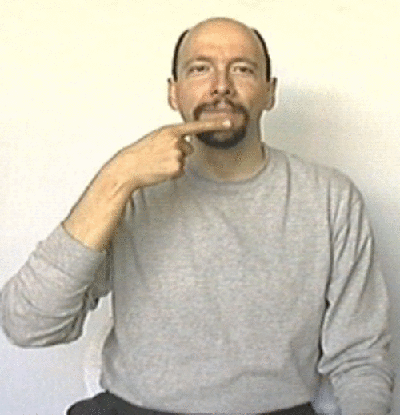
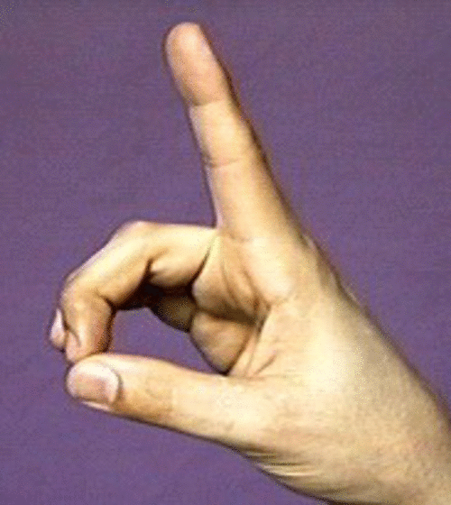
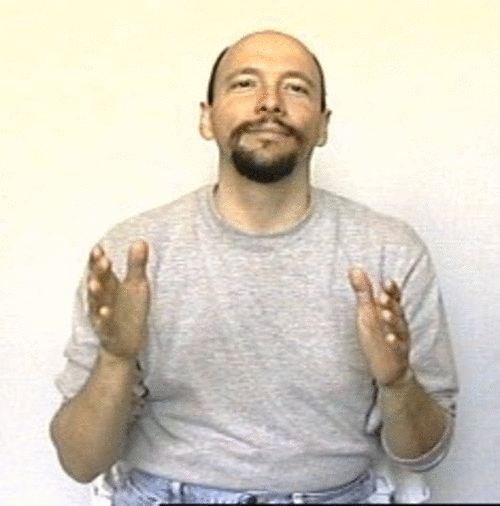
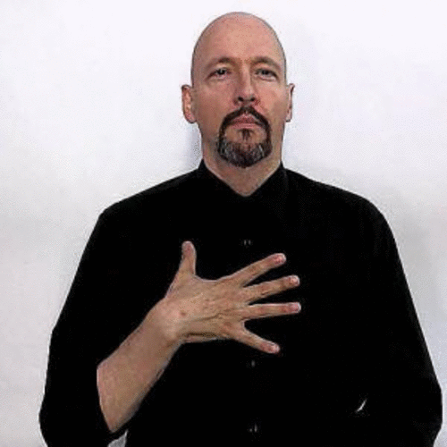
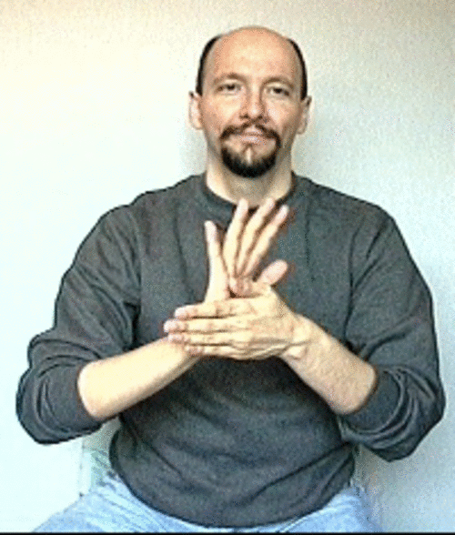
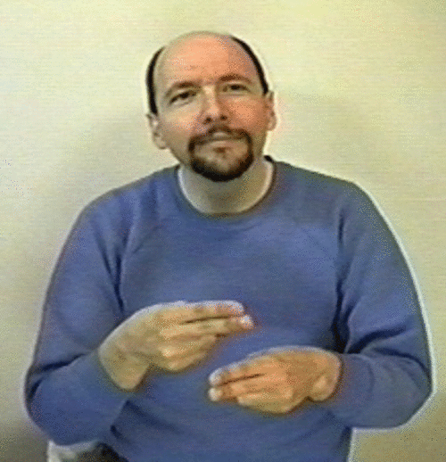
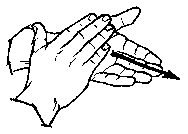

# Vocab List 1

Toilet:

Two of us:

[Two of us](http://www.signingsavvy.com/sign/TWO%20OF%20US/454/1)

Bye:

Deaf (person):

Hearing (person), fingers rotates forwards:

Dog:

Cat

Person:

Finish:

:

Don't like:

Hate:

Hello:

Meet:

We/us:

Movie:

Name:

Last:

Nice/clean:

Yes:

No:

Sign:

Language:

Shopping:

Party:

With:
