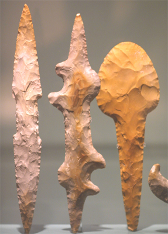

# The Neolithic Revolution and the Birth of Civilization

* **Neolithic Age** - New Stone Age. Period in the development of human
  technology beginning about 10,200 BC and ending between 4,500 and 2,000 BC.
* Early man used tools to accomplish tasks.
  * One of many examples of this is using a fire-starting stick with the bloom
    stalk of a yucca plan to start a fire for warmth and meals.
* The capacity to fashion tools distinguishes human beings from other animals.
  * Although other animals, such as apes, use tools, only humans construct
    them.
* Knowing how to create fire is a discovery unique to humans.
  * The use of fire for cooking allowed early humans to eat a wide range of
    foods, particularily animal protein.
* Our early ancestors could talk.

## Human Life in the Era of Hunters and Gatherers

* **Big History** - furthers discussion of when and how the human species
  emerged and what impact it would have, over time, on the physical environment
  and on other species. In this approach human history fits into a larger
  pattern of terrestrial change.
* **Paleolithic Age** - Old Stone Age. Prehistoric period of human history
  distinguished by the development of the most primitive stone tools and covers
  99% of human technological prehistory.
* By the late Paleolithic Age in 12,000 BC, humans were evolved into roughly
  the same appearance and intelligence as today.
  * Homo sapiens, our species, had been competing with increasing success for
    game and campsites for nearly 100,000 years.
  * Standing in an upright position freed the hands of homo sapiens. The
    combination of freed hands with opposable thumbs and a large brain enabled
    different human species to make and use tool sand weapons of increasing
    sophistication.
    * These implements helped to offset the humans' lack of body strength and
      speed to rival predators, such as wolves and wild cats.
    * A more developed brain allowed humans to transform grunts and other
      into what is now known as language.
      * Language enabled advanced communication between humans which allowed
        greater cooperation and cohesion between small bands that were the 
        predominant form of human social organization.
* Humans evolved to produce offspring that did not develop mature teeth until
  well after weaning.
  * For human children to survive, their parents or other adults had to devote
    a much longer period to providing food. This caused family structures
    to develop accordingly.

### Paleolithic Culture

* During the late Paleolithic Age, human groups survived by combining hunting
  and fishing with the gather of wild fruits, berries, grains, and roots.
* Instead of using wood and bone for tools, humans were using stone tools
  similar to the ones depicted below.

* The late Paleolithic was a period of particularly intense artistic
  creativity.
  * Fine miniature sculpture, beads, carved bones, and other forms of jewelry
    have been found dating from this period.
  * The most striking works discovered at ancient dwelling sites are cave
    paintings.
    * Some of these paintings appear to have religious significance.
* The art of the Old Stone Age indicates that humans were becoming increasingly
  interested in leaving lasting images of their activities and concerns.
